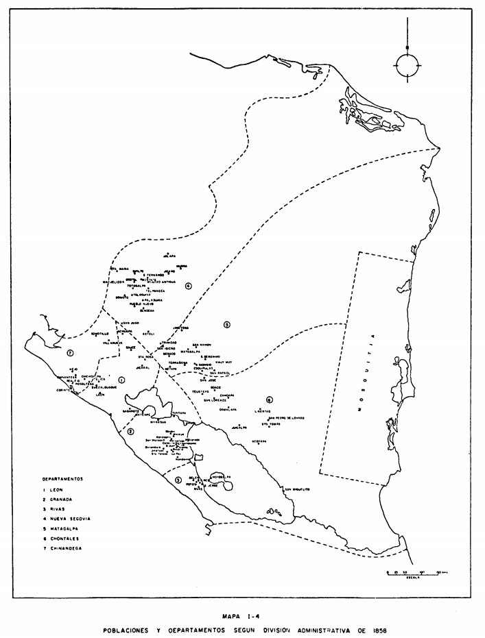

<!-- README.md is generated from README.Rmd. Please edit that file -->

```{r, include = FALSE}
knitr::opts_chunk$set(
  collapse = TRUE,
  comment = "#>",
  fig.path = "man/figures/README-",
  out.width = "100%"
)
```

# Población en Nicaragua: Siglo 18 y 19

Este repositorio aloja datos de la población en Nicaragua desde el año 1751 a 1875. Toda la información es extraída de Lanuza (1976). 

## Información en la base de datos

```{r, echo = FALSE, message = FALSE}
library(tidyverse)
library(lubridate)

data <- read_csv("data/pop_data.csv") 
```

```{r}
data
```
## Variables

Las siguientes variables se encuentran en este base de datos: 

* `year`: Año
* `department`: Departamento según división administrativa de 1852.
* `population`: Población total.

## Descargar los datos

Los datos se encuentran en la carpeta `/data` en formato [CSV](https://raw.githubusercontent.com/RRMaximiliano/poblacion-nicaragua-siglo-18-19/master/data/pop_data.csv). Al acceder el link, deberán darle click derecho "guardar como / save as".

## Mapa de la división administrativa del año 1852



## Comentarios y sugerencias

Para realizar comentarios o sugerencias sobre la base de datos puedes abrir un issue en este repositorio: [https://github.com/rrmaximiliano/poblacion-nicaragua-siglo-18-19/issues](https://github.com/rrmaximiliano/poblacion-nicaragua-siglo-18-19/issues)


## Referencias

Lanuza, A. (1976). Nicaragua: Territorio y población (1821-1875). *Revista del Pensamiento Centroamericano, XXXI*(151), 1-22. 
